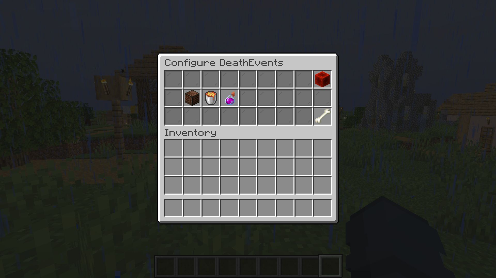

# Configuration GUI

On this GUI, you can configure all the different events on the plugin. You can find it on the /deconfig __Command!

\(Adding new GUI to this today!\)

Redstone Block \| Close the GUI

Note\_Block \| Configure the DeathSound

Lava\_Bucket \| Configure the DeathMessage

SPLASH\_POTION \| Configure the DeathParticles

Bone \| Get Support

